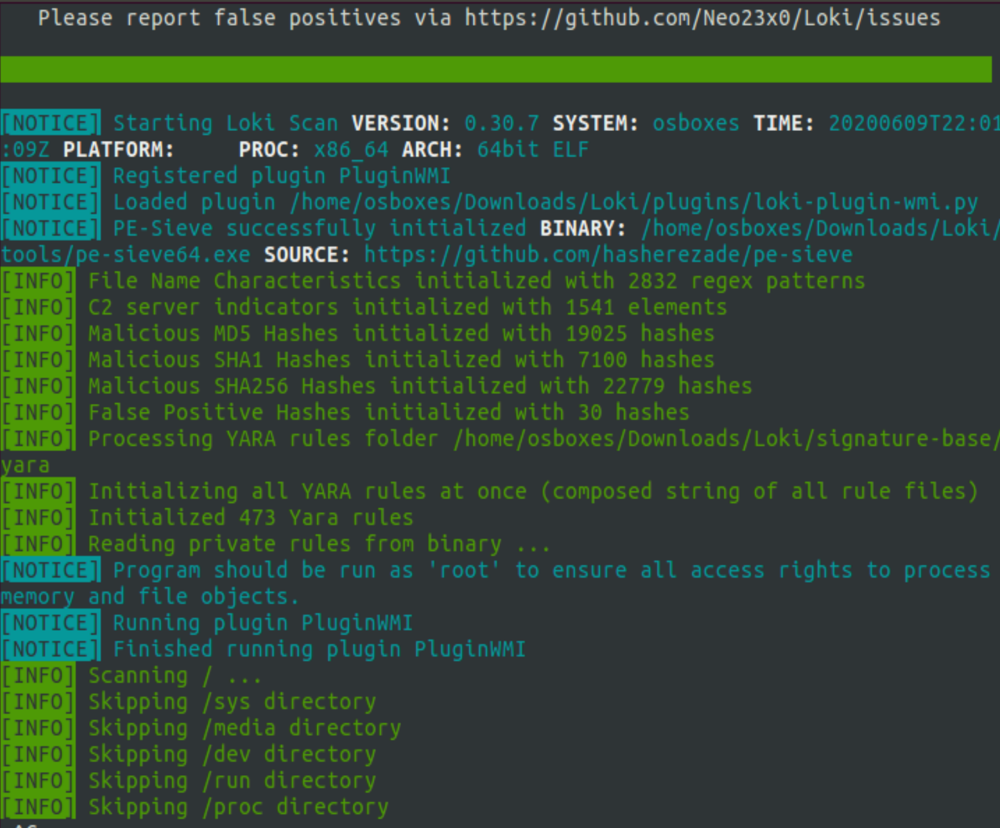
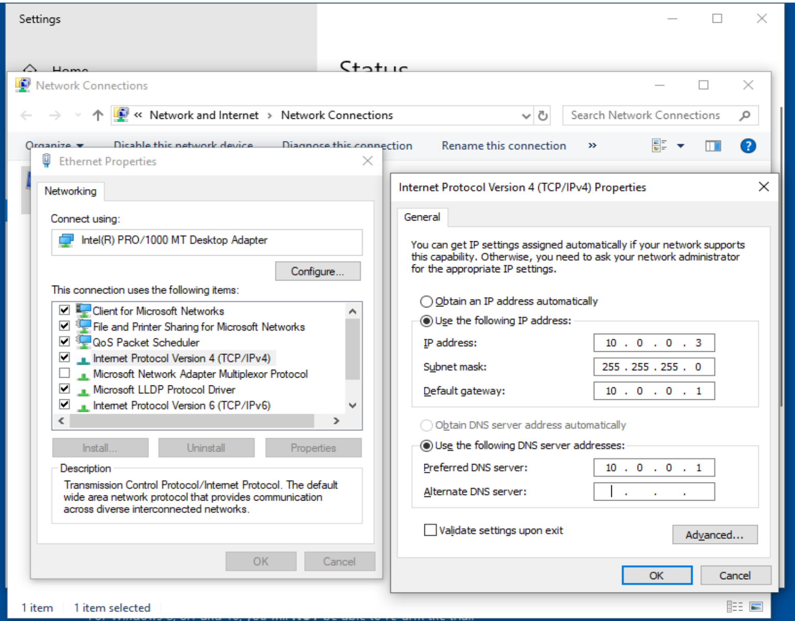

# An Advanced Persistent Threat Simulation Example under Loki Detection

## Set-up VMs

### Basic Ubuntu Analysis 

Download the image of Ubuntu 16.04-**64-bit** (*`Burp` can only run on 64-bit machines*) from [osboxes](https://www.osboxes.org/ubuntu/). Extract the `.vdl` file by [7-zip](https://www.7-zip.org/). Create a new VM named "Analysis Machine" in Virtualbox using this image.

Power on and log in with user `osboxes` and default password: `osboxes.org`.

Change the password as whatever you like in a terminal:

```
$ passwd osboxes
```

Update packages:

```
$ sudo apt-get update
$ sudo apt-get upgrade
```

Install the guest additions. <kbd>Devices</kbd> -> <kbd>Insert guest additions CD image</kbd>. If you are in scaled mode, press <kbd>Right Ctrl</kbd> + <kbd>C</kbd> to exit and the menu bar appears. if asked password, type in the password you set right now. When finishing the process, power off this VM (`Analysis Machine`).

### Clone as Ubuntu Victim

Clone `Analysis Machine` as `Victim 1`, Choose <kbd>Generate new MAC address for all network adapters</kbd> for <kbd>MAC address policy</kbd>. Use <kbd>Full clone</kbd>.

### Install Windows Victim

Download a Windows 10 VM (Choose VirtualBox as VM platform) from [Microsoft official site](https://developer.microsoft.com/en-us/microsoft-edge/tools/vms/) and extract the `.ova` file.

Setup a Windows 10 VM in VirtualBox:

1. Select <kbd>File</kbd> > <kbd>Import Appliance</kbd>, import the `.ova` file extracted above
2. Assign at least 1024 MB of RAM for it
3. Choose `Generate new MAC address for all network adapters`


4. After import finishes, Rename it as "Victim 2" and power it on
5. Log-in with username `IEUser` and default password `Passw0rd!`, Check if anything abnormal.
6. Power off

Install the guest additions:

1. For this VM, <kbd>Settings</kbd> -> <kbd>Storage</kbd>, add a new drive:


2. Confirm all default settings, power on and log in
3. <kbd>Devices</kbd> -> <kbd>Insert guest additions CD image</kbd>
4. Open the file manager in VM, enter the CD drive (`VBoxGuestAddition.iso`) and then double click `VBoxWindowsAdditions.exe`.
5. Follow the guide and finish installing.

Now, the VM can be powered off.

By the way, for convenience, all VM's general setting can choose `Bidirectional` for <kbd>shared clipboard</kbd> and <kbd>Drag'n'Drop</kbd>.

## Build Analysis and Simulation Tools on Analysis

All following works in this section are done on `Ubuntu Analysis`.

First, install `git` and `pip`:

```
$ sudo apt install git
$ sudo apt install python-pip
```
### Install `loki`

Loki: https://github.com/Neo23x0/Loki

**Note**: To download the last version from [release](https://github.com/Neo23x0/Loki/releases) and then extract is **not** a feasible approach on Ubuntu, `.exe` cannot be executed directly on Linux.

First, install the last version of `yara` (**built with OpenSSL**), which may require **root user privilege** sometimes, or you will get [the same error](https://github.com/Neo23x0/Loki/issues/147) as mines. Follow `yara`'s [documentation](https://yara.readthedocs.io/en/stable/gettingstarted.html) and adjust by your environment:

```
$ git clone https://github.com/VirusTotal/yara.git
$ cd yara
$ bash ./bootstrap.sh
$ sudo apt-get install automake libtool make gcc pkg-config libssl-dev
$ ./configure --with-crypto
$ make
$ sudo make install
```

Run test cases to check if building is Okay:

```
$ make check
```

Check if `yara` is installed correctly:

```
$ yara version
4.0.1
```

If it prints:

```
yara: error while loading shared libraries: libyara.so.4: cannot open shared object file: No such file or directory
```

Do:

```
$ su
# sudo sh -c 'echo "/usr/local/lib" >> /etc/ld.so.conf'
# sudo ldconfig
```

Make sure that `yara` is installed properly and then we are going to install `loki`.

Download all`loki` source codes and enter the folder:

```
$ git clone https://github.com/Neo23x0/Loki.git
$ cd ./Loki
```

Since `loki.py` should be interpreted by Python 2.7, first, we need to install some dependencies:

```
$ pip install psutil netaddr colorama pylzma pycrypto yara-python rfc5424-logging-handler setuptools==19.2 pyinstaller==2.1
```

After installed, Run `loki` to complete a simple IOC scan:

```
$ python loki.py
```



### Install `INetSim`

It can simulate a bunch of standard Internet services on a machine.

Follow [this instruction](https://www.inetsim.org/packages.html)

```
$ su
# echo "deb http://www.inetsim.org/debian/ binary/" > /etc/apt/sources.list.d/inetsim.list
# echo "deb-src http://www.inetsim.org/debian/ source/" >> /etc/apt/sources.list.d/inetsim.lis
# wget -O - https://www.inetsim.org/inetsim-archive-signing-key.asc | apt-key add -
# apt update
# apt install inetsim
```

### Install `Burp`

Make up for the limitation of `INetSim`'s SSL supports.

Download [last release](https://portswigger.net/burp/communitydownload) of `Brup` (suppose in `~/Downloads`), then execute it by

```
$ bash ~/Downloads/burpsuite_community_linux_v2020_5.sh
```

## Network Settings

As it mentioned in the [original post](https://blog.christophetd.fr/malware-analysis-lab-with-virtualbox-inetsim-and-burp/):

> As a reminder, we want to set up an **isolated network** containing our three VMs. This network will not be able to access the Internet. Also, we want the **analysis machine to act as a network gateway to the victim machines** in order to easily be able to intercept the network traffic and to simulate various services such as DNS or HTTP.

First, we open the <kbd>Settings</kbd> -> <kbd>Network<kbd>  of those 3 VMs, change their <kbd> Adapter 1</kbd> -> <kbd>Attached to</kbd> to `Internal Network`, fill <kbd>Name</kbd> field with `apt-network`.

### Ubuntu Analysis: Gateway `10.0.0.1`

To make `Analysis Machine` serve as a gateway, on it:

type `ifconfig` and get its Ethernet interface name as `enp0s3`. Open and edit its config by:

```
$ sudo gedit /etc/network/interfaces
```

Append those lines to the ending:

```
auto enp0s3
iface enp0s3 inet static
 address 10.0.0.1
 netmask 255.255.255.0
```

Save and exit `gedit`.

Update:

```
$ sudo ifup enp0s3
```

Now it has a static IP address as `10.0.0.1`, we can verify it via:

```
$ ifconfig
```

**Keep this VM alive for validation later.**

### Victim 1: Ubuntu Victim `10.0.0.2`

Similarly, edit `/etc/network/interfaces`, with the following lines appended:

```
auto enp0s3
iface enp0s3 inet static
 address 10.0.0.2
 gateway 10.0.0.1
 netmask 255.255.255.0
 dns-nameservers 10.0.0.1
```

Which indicates that `Victim 1` regards `Analysis Machine` as its gateway and DNS server.

Update the config:

```
$ sudo ifup enp0s3
$ sudo service networking restart
```

**Keep this VM alive for validation later.**


### Victim 2: Windows Victim `10.0.0.3`

Similar to Victim 1, Open its network settings:


Change the network adapter properties as



Finally, `ping` each other by IP address using `cmd` or `terminal` on each VM. If all VMs are reachable but unable to connect with external addresses, the isolated network is set.

**Note**: If `Victim 2` cannot be pinged by other VMs, try to turn off its Windows built-in firewall.


## References

[1] https://www.usenix.org/legacy/event/lisa09/tech/slides/daly.pdf

[2] https://en.wikipedia.org/wiki/Advanced_persistent_threat

[3] https://blog.christophetd.fr/malware-analysis-lab-with-virtualbox-inetsim-and-burp/