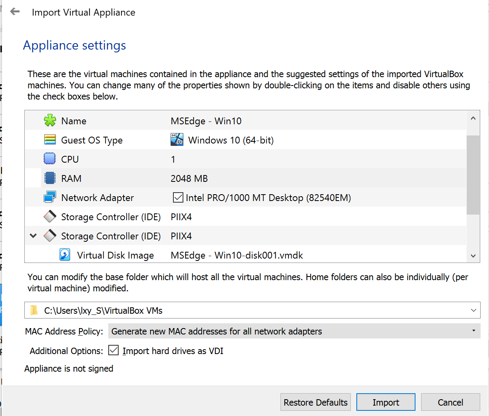
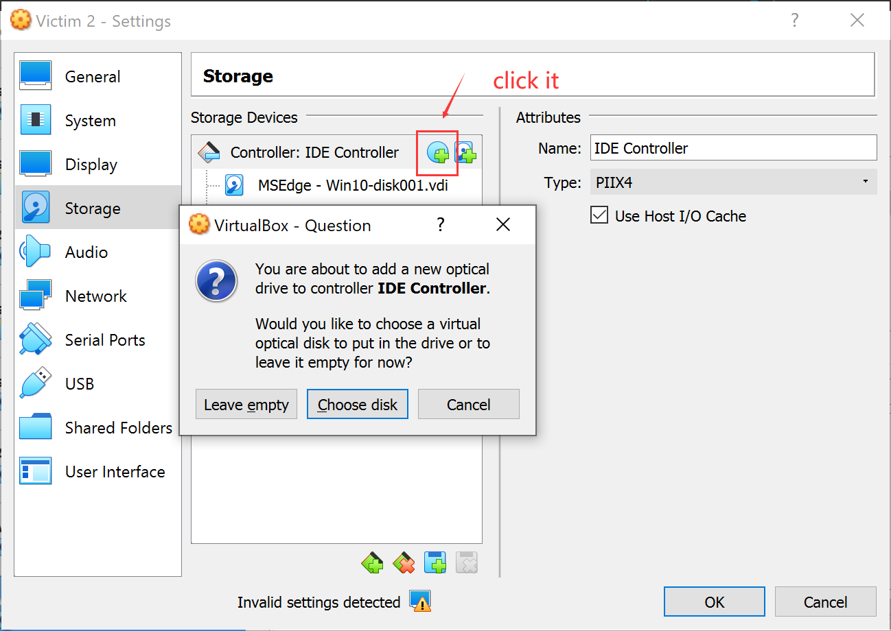
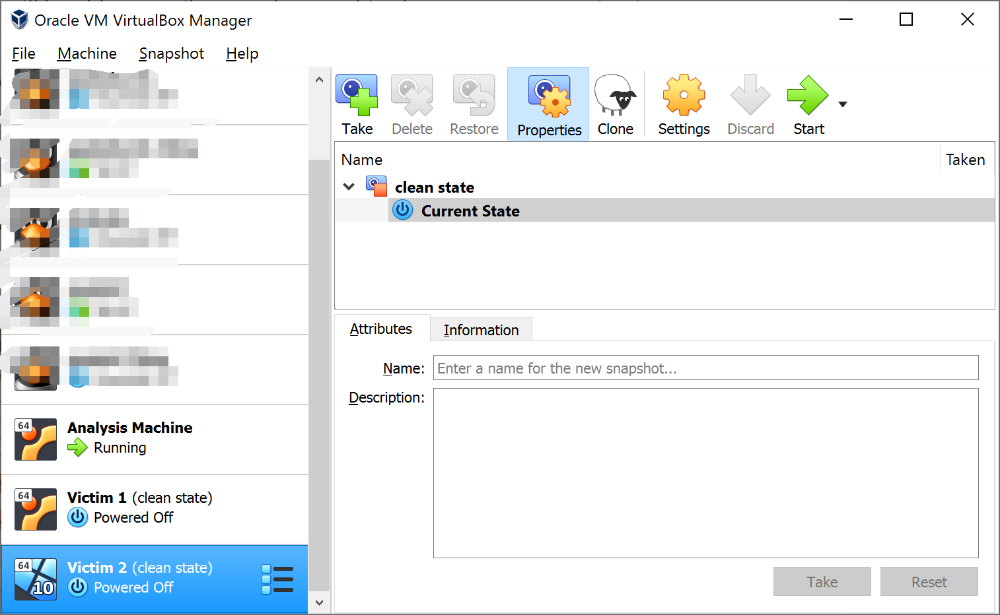
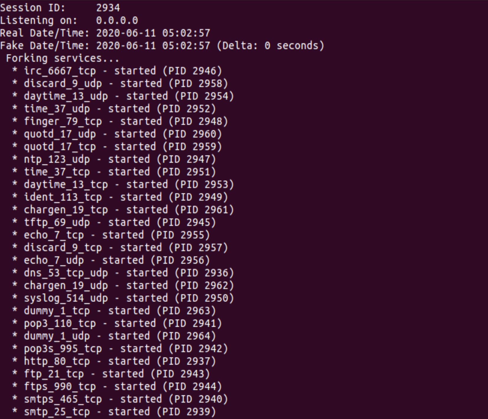
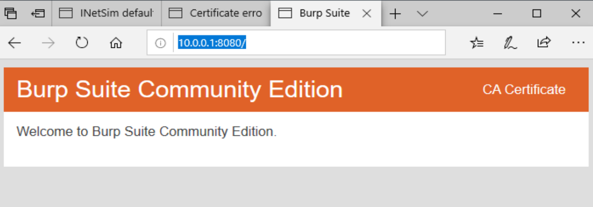

# An Advanced Persistent Threat Simulation Example under Loki Detection

## Set-up VMs

### Basic Ubuntu Analysis 

Download the image of Ubuntu 16.04-**64-bit** (*`Burp` can only run on 64-bit machines*) from [osboxes](https://www.osboxes.org/ubuntu/). Extract the `.vdl` file by [7-zip](https://www.7-zip.org/). Create a new VM named "Analysis Machine" in Virtualbox using this image.

Power on and log in with user `osboxes` and default password: `osboxes.org`.

Change the password as whatever you like in a terminal:

```
$ passwd osboxes
```

Update packages:

```
$ sudo apt-get update
$ sudo apt-get upgrade
```

Install the guest additions. <kbd>Devices</kbd> -> <kbd>Insert guest additions CD image</kbd>. If you are in scaled mode, press <kbd>Right Ctrl</kbd> + <kbd>C</kbd> to exit and the menu bar appears. if asked password, type in the password you set right now. When finishing the process, power off this VM (`Analysis Machine`).

### Clone as Ubuntu Victim

Clone `Analysis Machine` as `Victim 1`, Choose <kbd>Generate new MAC address for all network adapters</kbd> for <kbd>MAC address policy</kbd>. Use <kbd>Full clone</kbd>.

### Install Windows Victim

Download a Windows 10 VM (Choose VirtualBox as VM platform) from [Microsoft official site](https://developer.microsoft.com/en-us/microsoft-edge/tools/vms/) and extract the `.ova` file.

Setup a Windows 10 VM in VirtualBox:

1. Select <kbd>File</kbd> > <kbd>Import Appliance</kbd>, import the `.ova` file extracted above
2. Assign at least 1024 MB of RAM for it
3. Choose `Generate new MAC address for all network adapters`




4. After import finishes, Rename it as "Victim 2" and power it on
5. Log-in with username `IEUser` and default password `Passw0rd!`, Check if anything abnormal.
6. Power off

Install the guest additions:

1. For this VM, <kbd>Settings</kbd> -> <kbd>Storage</kbd>, add a new drive:



2. Confirm all default settings, power on and log in
3. <kbd>Devices</kbd> -> <kbd>Insert guest additions CD image</kbd>
4. Open the file manager in VM, enter the CD drive (`VBoxGuestAddition.iso`) and then double click `VBoxWindowsAdditions.exe`.
5. Follow the guide and finish installing.

Now, the VM can be powered off.

By the way, for convenience, all VM's general setting can choose `Bidirectional` for <kbd>shared clipboard</kbd> and <kbd>Drag'n'Drop</kbd>.

## Build Analysis and Simulation Tools on Analysis

All following works in this section are done on `Ubuntu Analysis`.

First, install `git`, `pip` and `curl`:

```
$ sudo apt install git
$ sudo apt install python-pip
$ sudo apt install curl
```
### Install `loki`

Loki: https://github.com/Neo23x0/Loki

**Note**: To download the last version from [release](https://github.com/Neo23x0/Loki/releases) and then extract is **not** a feasible approach on Ubuntu, `.exe` cannot be executed directly on Linux.

First, install the last version of `yara` (**built with OpenSSL**), which may require **root user privilege** sometimes, or you will get [the same error](https://github.com/Neo23x0/Loki/issues/147) as mines. Follow `yara`'s [documentation](https://yara.readthedocs.io/en/stable/gettingstarted.html) and adjust by your environment:

```
$ git clone https://github.com/VirusTotal/yara.git
$ cd yara
$ bash ./bootstrap.sh
$ sudo apt-get install automake libtool make gcc pkg-config libssl-dev
$ ./configure --with-crypto
$ make
$ sudo make install
```

Run test cases to check if building is Okay:

```
$ make check
```

Check if `yara` is installed correctly:

```
$ yara version
4.0.1
```

If it prints:

```
yara: error while loading shared libraries: libyara.so.4: cannot open shared object file: No such file or directory
```

Do:

```
$ su
# sudo sh -c 'echo "/usr/local/lib" >> /etc/ld.so.conf'
# sudo ldconfig
```

Make sure that `yara` is installed properly and then we are going to install `loki`.

Download all`loki` source codes and enter the folder:

```
$ git clone https://github.com/Neo23x0/Loki.git
$ cd ./Loki
```

Since `loki.py` should be interpreted by Python 2.7, first, we need to install some dependencies:

```
$ pip install psutil netaddr colorama pylzma pycrypto yara-python rfc5424-logging-handler setuptools==19.2 pyinstaller==2.1
```

After installed, Run `loki` to complete a simple IOC scan:

```
$ python loki.py
```


### Install `INetSim`

It can simulate a bunch of standard Internet services on a machine.

Follow [this instruction](https://www.inetsim.org/packages.html)

```
$ su
# echo "deb http://www.inetsim.org/debian/ binary/" > /etc/apt/sources.list.d/inetsim.list
# echo "deb-src http://www.inetsim.org/debian/ source/" >> /etc/apt/sources.list.d/inetsim.lis
# wget -O - https://www.inetsim.org/inetsim-archive-signing-key.asc | apt-key add -
# apt update
# apt install inetsim
```

### Install `Burp`

Make up for the limitation of `INetSim`'s SSL supports.

Download [last release](https://portswigger.net/burp/communitydownload) of `Brup` (suppose in `~/Downloads`), then execute it by

```
$ bash ~/Downloads/burpsuite_community_linux_v2020_5.sh
```

## Network Settings

As it mentioned in the [original post](https://blog.christophetd.fr/malware-analysis-lab-with-virtualbox-inetsim-and-burp/):

> As a reminder, we want to set up an **isolated network** containing our three VMs. This network will not be able to access the Internet. Also, we want the **analysis machine to act as a network gateway to the victim machines** in order to easily be able to intercept the network traffic and to simulate various services such as DNS or HTTP.

First, we open the <kbd>Settings</kbd> -> <kbd>Network<kbd>  of those 3 VMs, change their <kbd> Adapter 1</kbd> -> <kbd>Attached to</kbd> to `Internal Network`, fill <kbd>Name</kbd> field with `apt-network`.

### Ubuntu Analysis: Gateway `10.0.0.1`

To make `Analysis Machine` serve as a gateway, on it:

type `ifconfig` and get its Ethernet interface name as `enp0s3`. Open and edit its config by:

```
$ sudo gedit /etc/network/interfaces
```

Append those lines to the ending:

```
auto enp0s3
iface enp0s3 inet static
 address 10.0.0.1
 netmask 255.255.255.0
```

Save and exit `gedit`.

Update:

```
$ sudo ifup enp0s3
```

Now it has a static IP address as `10.0.0.1`, we can verify it via:

```
$ ifconfig
```

**Keep this VM alive for validation later.**

### Victim 1: Ubuntu Victim `10.0.0.2`

Similarly, edit `/etc/network/interfaces`, with the following lines appended:

```
auto enp0s3
iface enp0s3 inet static
 address 10.0.0.2
 gateway 10.0.0.1
 netmask 255.255.255.0
 dns-nameservers 10.0.0.1
```

Which indicates that `Victim 1` regards `Analysis Machine` as its gateway and DNS server.

Update the config:

```
$ sudo ifup enp0s3
$ sudo service networking restart
```

**Keep this VM alive for validation later.**


### Victim 2: Windows Victim `10.0.0.3`

Similar to Victim 1, Open its network settings:


Change the network adapter properties as


Finally, `ping` each other by IP address using `cmd` or `terminal` on each VM. If all VMs are reachable but unable to connect with external addresses, the isolated network is set.

**Note**: If `Victim 2` cannot be pinged by other VMs, try to turn off its Windows built-in firewall.

## Restore Clean-state Snapshot for Victims

Now, **both 2 victim VMs** are in a clean (uninjected) state. We can power them off and create snapshots of current states for back-up:

Take snapshots for 2 victims and name snapshots as `clean state`:



## Analyze Network Traffic

### `INetSim` Part

On `Analysis Machine`: Create a directory `analysis` to store `INetSim` configurations for each analysis (in a separate subdirectory):

```
$ mkdir analysis
```

Start an example (`test-analysis`) for testing:

```
$ mkdir analysis/test-analysis
```

Use the default configuration:

```
$ cp /etc/inetsim/inetsim.conf analysis/test-analysis
$ sudo cp -r /var/lib/inetsim analysis/test-analysis/data
$ cd analysis/test-analysis
$ sudo chmod -R 777 data
```

Edit `inetsim.conf`, replace the lines

```
#service_bind_address 10.10.10.1 (any address possible)

#dns_default_ip    10.10.10.1 (any address possible)

#https_bind_port 443
```

with

```
service_bind_address  0.0.0.0

dns_default_ip    10.0.0.1

https_bind_port 8443
```

and save.

Now, `INetSim` will update configurations as:

- listen on local ports -> all reachable machine in virtual network
- resolve all domain names to `127.0.0.1` -> `10.0.0.1`
- Bind HTTP server to port `443` -> `8433` (for that `INetSim`'s SSL supports is too limited, leave SSL traffic for `Burp` later)

> we need to disable `systemd-resolved`, which is a local DNS server shipped by default with Ubuntu and will conflict with `INetSim`'s DNS server.

```
$ sudo systemctl disable systemd-resolved.service
$ sudo service systemd-resolved stop
```

Now, let's start `INetSim`:

```
$ sudo inetsim --data data --conf inetsim.conf
INetSim 1.3.2 (2020-05-19) by Matthias Eckert & Thomas Hungenberg
Using log directory:      /var/log/inetsim/
Using data directory:     data/
Using report directory:   /var/log/inetsim/report/
Using configuration file: /home/osboxes/analysis/test-analysis/inetsim.conf
Parsing configuration file.
Configuration file parsed successfully.
=== INetSim main process started (PID 2717) ===
Session ID:     2717
Listening on:   0.0.0.0
Real Date/Time: 2020-06-11 04:23:03
Fake Date/Time: 2020-06-11 04:23:03 (Delta: 0 seconds)
 Forking services...
  * time_37_tcp - started (PID 2734)
  * ntp_123_udp - started (PID 2730)
  * irc_6667_tcp - started (PID 2729)
  * time_37_udp - started (PID 2735)
  * daytime_13_tcp - started (PID 2736)
  * ident_113_tcp - started (PID 2732)
  * echo_7_tcp - started (PID 2738)
  * discard_9_tcp - started (PID 2740)
  * quotd_17_tcp - started (PID 2742)
  * daytime_13_udp - started (PID 2737)
  * finger_79_tcp - started (PID 2731)
  * syslog_514_udp - started (PID 2733)
  * discard_9_udp - started (PID 2741)
  * dns_53_tcp_udp - started (PID 2719)
  * dummy_1_udp - started (PID 2747)
  * echo_7_udp - started (PID 2739)
  * quotd_17_udp - started (PID 2743)
  * chargen_19_udp - started (PID 2745)
  * chargen_19_tcp - started (PID 2744)
  * tftp_69_udp - started (PID 2728)
  * dummy_1_tcp - started (PID 2746)
  * ftps_990_tcp - started (PID 2727)
  * pop3_110_tcp - started (PID 2724)
  * pop3s_995_tcp - started (PID 2725)
  * smtp_25_tcp - started (PID 2722)
  * ftp_21_tcp - started (PID 2726)
  * smtps_465_tcp - started (PID 2723)
  * http_80_tcp - started (PID 2720)
  * https_8443_tcp - started (PID 2721)
 done.
```



---

Some issues you may meet when starting `INetSim`:

#### Issue 1

If you come across the error:

```
PIDfile '/var/run/inetsim.pid' exists - INetSim already running?
```

Just "kill" it and the restart `INetSim`:

```
sudo rm /var/run/inetsim.pid
```

If you are sure that there is really an `INetSim` in background (check by `top`), stop it

```
$ service inetsim stop
```

#### Issue 2

If some services fail to start, try to edit `service_bind_address` as `10.0.0.1` then restart. If the solution works, it means some processes block the ports associated with `0.0.0.0`. See [another answer by me](https://stackoverflow.com/a/62320178/4710264). List all those process candidates with their `pid` in the last column:

```
sudo netstat -tulpn
```

Kill those suspicious processes:

```
sudo kill -9 <pid>
```

---

Power on `Victim 1`:

Open Firefox, <kbd>Preferences</kbd> -> <kbd>Cookies and Site Data</kbd> -> <kbd>Clear data</kbd>, check `Cookies and Site Data` and `Cached Web Content` to clear all history content data in it. Then open a website, for instance, `google.com` :


Apparently, it is hijacked by `INetSim`. This fake page, which is the default `HTML` sample file contained in `INetSim`, is hosted in `Analysis Machine`'s `data/http/fakefiles/sample.html.`.

---

Return to `Analysis Machine`.

Stop `INetSim` by <kbd>Ctrl</kbd> + <kbd>C</kbd>. It will print the location of report/log file. Open the file with `sudo gedit` or display it with `sudo cat`. We can find relevant network traffics with:


### `Burp` Part (SSL interception)

`Burp` will run as a transparent proxy in front of `INetSim`.

It is the role `Burp` plays in an SSL interception attack:


Start `Burp` with root privilege, otherwise, it cannot access port 443:

```
$ cd ~/BurpSuiteCommunity
$ su
# sudo ./BurpSuiteCommunity
```

1. Create a Temporarily project (no other available options)
2. Check "Use Burp defaults"
3. Start Burp

Enter <kbd>Proxy</kbd> -> <kbd>Options</kbd> panel, Edit the row in Proxy Listeners:

- Binding tab
    - Bind to port: 443
    - Bind to address: all interfaces
- Request handling tab:
    - Redirect to host: localhost
    - Redirect to port: 8443
    - Check Support invisible proxying

Check `Running`, if it fails because port 443 is occupied, see [Issue 1](#issue-1).

> By default, Burp intercepts the incoming requests and waits for you to explicitly let them pass through. To avoid this, go to the Intercept tab and click the button <kbd>Intercept is on</kbd> to disable it.
> Since Burp Free doesn’t allow you to save a project, you can export the settings we just made in order to import them next time you start Burp. To do this, use `Burp` > <kbd>Project options</kbd> > <kbd>Save</kbd> project options.

Save the options as `test` in `/root`.

Start `INetSim`

```
$ sudo inetsim --data data --conf inetsim.conf
```

Keep it running, meanwhile, test:

```
$ curl --insecure https://localhost
```

We will get:

```html
<html>
  <head>
    <title>INetSim default HTML page</title>
  </head>
  <body>
    <p></p>
    <p align="center">This is the default HTML page for INetSim HTTP server fake mode.</p>
    <p align="center">This file is an HTML document.</p>
  </body>
</html>
```

It is what we see in [previous subsection](#inetsim-part).


#### Importing `Burp`'s CA certificate on our victim machines

Power on `Victim 2` (Win 10), try to open https://github.com/ (or any HTTPS link) on Edge browser, it alerts:


> This is because Burp generates a SSL certificate signed by its own CA certificate, which our victim machine doesn’t trust for now.

Back to `Analysis Machine`. In `Brup`, enter <kbd>Proxy</kbd> -> <kbd>Options</kbd> -> <kbd>Add</kbd> , add a new proxy listener on port `8080` and all interfaces.

---

Now, from `Victim 2`, open http://10.0.0.1:8080/



Click on `CA Certificate` to download Burp’s CA certificate. Save and open the file, Install Certificate:

Choose the field

- Place all certificates in the following store: Trusted Root Certification Authorities

Then open https://github.com/ on Edge Browser or IE, the fake page is trusted with SSL:


---

On `Victim 1`, similarly, visit http://10.0.0.1:8080/ on browser and download Burp’s CA certificate (Suppose it is saved as `~/Downloads/cacert.der`).

Convert the certificate to the appropriate format (`.crt`)

```
$ openssl x509 -in ~/Downloads/cacert.der -inform DER -out burp.crt
```

Copy it to `/usr/local/share/ca-certificates`

```
$ sudo cp burp.crt /usr/local/share/ca-certificates/
```

Run

```
$ sudo update-ca-certificates
1 added, 0 removed; done.
Running hooks in /etc/ca-certificates/update.d...
done.
```

> Firefox by default doesn't use the system's certificate store. If you want the SSL connection to work properly in Firefox as well, go to the Firefox settings into Advanced > Certificates > Import. Choose `burp.crt`, check Trust this CA to identify websites

In Firefox, Search for "Certificates" in the Preferences page, <kbd>View Certificates</kbd> -><kbd>Authorities</kbd> Panel - > <kbd>Import</kbd> Button -> Select `burp.crt` -> check "Trust this CA to identify websites".

It works:


---

Now, power off and take new snapshots for both 2 victims, name the state as "clean state with burp CA".


## References

[1] https://www.usenix.org/legacy/event/lisa09/tech/slides/daly.pdf

[2] https://en.wikipedia.org/wiki/Advanced_persistent_threat

[3] https://blog.christophetd.fr/malware-analysis-lab-with-virtualbox-inetsim-and-burp/