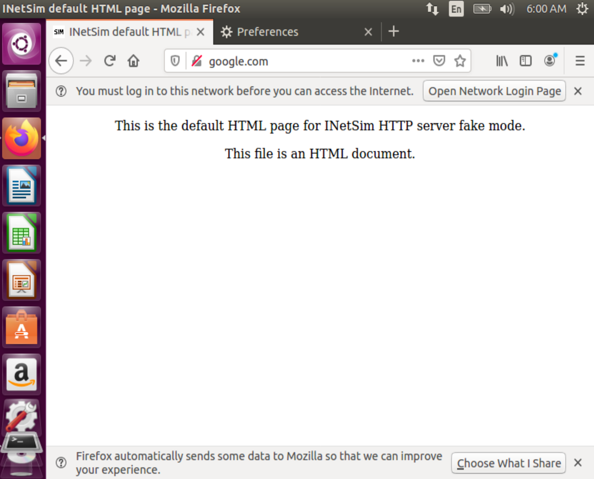
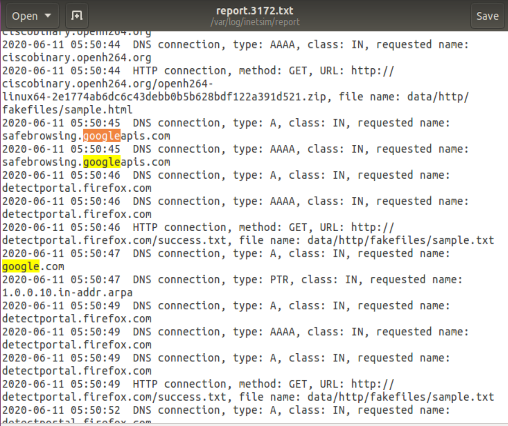
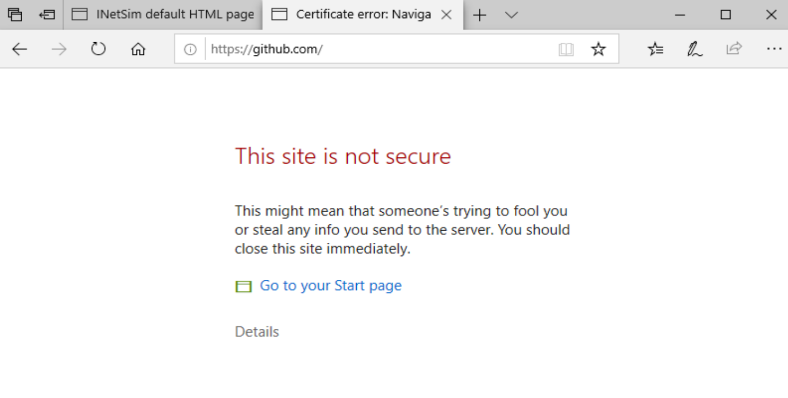
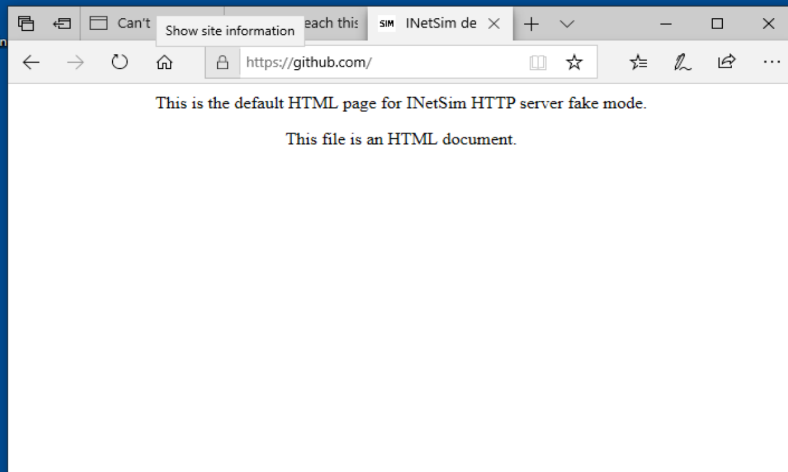
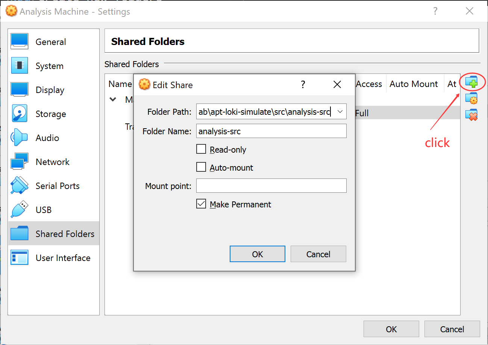
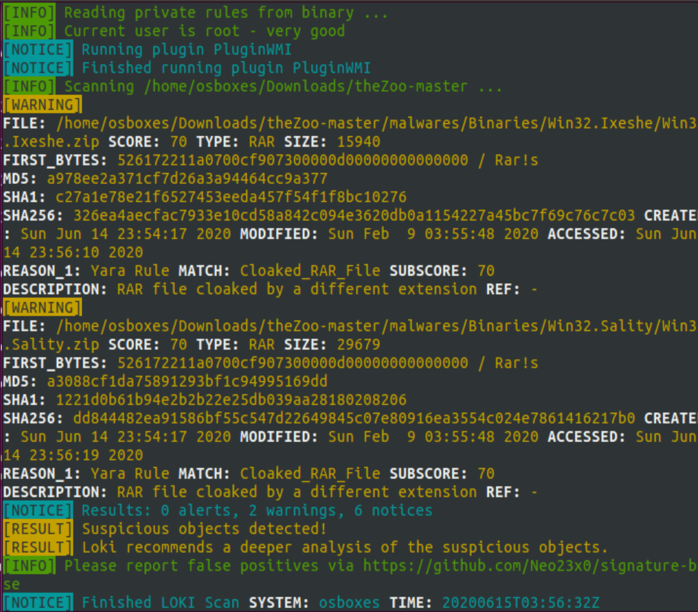
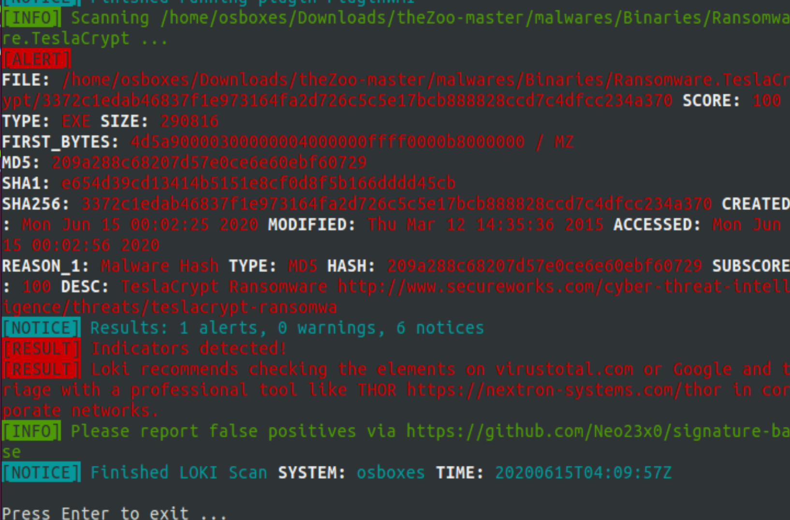
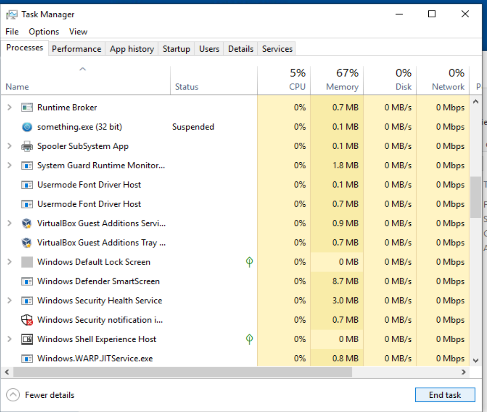
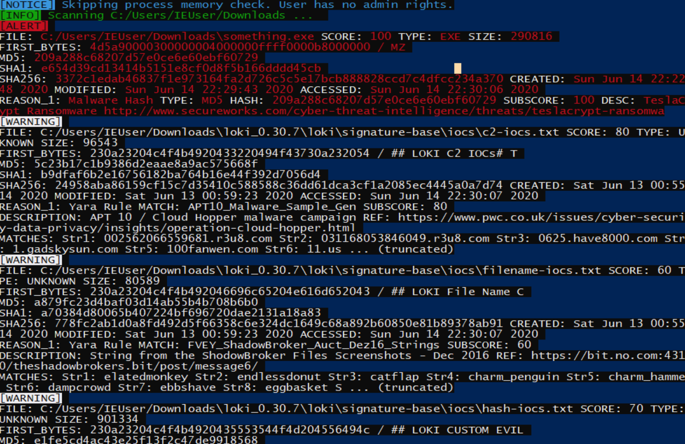

# An Advanced Persistent Threat Simulation Example under Loki Detection

[](https://www.osboxes.org/ubuntu/)
[](https://developer.microsoft.com/en-us/microsoft-edge/tools/vms/)
[](https://github.com/Neo23x0/Loki)
[](https://www.inetsim.org/documentation.html)
[](https://github.com/VirusTotal/yara)
[](https://portswigger.net/burp/communitydownload)


- [An Advanced Persistent Threat Simulation Example under Loki Detection](#an-advanced-persistent-threat-simulation-example-under-loki-detection)
  - [Set-up VMs](#set-up-vms)
    - [Basic Ubuntu Analysis](#basic-ubuntu-analysis)
    - [Clone as Ubuntu Victim](#clone-as-ubuntu-victim)
    - [Install Windows Victim](#install-windows-victim)
  - [Install `loki` for all VMs](#install-loki-for-all-vms)
    - [Windows 10](#windows-10)
    - [Ubuntu](#ubuntu)
  - [Build Analysis and Simulation Tools on Analysis](#build-analysis-and-simulation-tools-on-analysis)
    - [Install `INetSim`](#install-inetsim)
    - [Install `Burp`](#install-burp)
  - [Network Settings](#network-settings)
    - [Ubuntu Analysis: Gateway `10.0.0.1`](#ubuntu-analysis-gateway-10001)
    - [Victim 1: Ubuntu Victim `10.0.0.2`](#victim-1-ubuntu-victim-10002)
    - [Victim 2: Windows Victim `10.0.0.3`](#victim-2-windows-victim-10003)
  - [Restore Clean-state Snapshot for Victims](#restore-clean-state-snapshot-for-victims)
  - [Analyze Network Traffic](#analyze-network-traffic)
    - [`INetSim` Part](#inetsim-part)
      - [Issue 1](#issue-1)
      - [Issue 2](#issue-2)
    - [`Burp` Part (SSL interception)](#burp-part-ssl-interception)
      - [Importing `Burp`'s CA certificate on our victim machines](#importing-burps-ca-certificate-on-our-victim-machines)
  - [Transfer Files between VMs and Host](#transfer-files-between-vms-and-host)
    - [Create a Shared Folder for analysis](#create-a-shared-folder-for-analysis)
    - [Transfer Files to Victim VMs](#transfer-files-to-victim-vms)
      - [An alternative way on `Victim 1`](#an-alternative-way-on-victim-1)
      - [An alternative way on `Victim 2`](#an-alternative-way-on-victim-2)
  - [Demo: the TeslaCrypt ransomware](#demo-the-teslacrypt-ransomware)
    - [Send it to `Analysis Machine`:](#send-it-to-analysis-machine)
    - [Send the malicious `exe` to `Victim 2`](#send-the-malicious-exe-to-victim-2)
  - [References](#references)


## Set-up VMs

### Basic Ubuntu Analysis 

Download the image of Ubuntu 16.04-**64-bit** (*`Burp` can only run on 64-bit machines*) from [osboxes](https://www.osboxes.org/ubuntu/). Extract the `.vdl` file by [7-zip](https://www.7-zip.org/). Create a new VM named "Analysis Machine" in Virtualbox using this image.

Power on and log in with user `osboxes` and default password: `osboxes.org`.

Change the password as whatever you like in a terminal:

```
$ passwd osboxes
```

Update packages:

```
$ sudo apt-get update
$ sudo apt-get upgrade
```

Install the guest additions. <kbd>Devices</kbd> -> <kbd>Insert guest additions CD image</kbd>. If you are in scaled mode, press <kbd>Right Ctrl</kbd> + <kbd>C</kbd> to exit and the menu bar appears. if asked password, type in the password you set right now. When finishing the process, power off this VM (`Analysis Machine`).

### Clone as Ubuntu Victim

Clone `Analysis Machine` as `Victim 1`, Choose <kbd>Generate new MAC address for all network adapters</kbd> for <kbd>MAC address policy</kbd>. Use <kbd>Full clone</kbd>.

### Install Windows Victim

Download a Windows 10 VM (Choose VirtualBox as VM platform) from [Microsoft official site](https://developer.microsoft.com/en-us/microsoft-edge/tools/vms/) and extract the `.ova` file.

Setup a Windows 10 VM in VirtualBox:

1. Select <kbd>File</kbd> > <kbd>Import Appliance</kbd>, import the `.ova` file extracted above
2. Assign at least 1024 MB of RAM for it
3. Choose `Generate new MAC address for all network adapters`


4. After import finishes, Rename it as "Victim 2" and power it on
5. Log-in with username `IEUser` and default password `Passw0rd!`, Check if anything abnormal.
6. Power off

Install the guest additions:

1. For this VM, <kbd>Settings</kbd> -> <kbd>Storage</kbd>, add a new drive:


2. Confirm all default settings, power on and log in
3. <kbd>Devices</kbd> -> <kbd>Insert guest additions CD image</kbd>
4. Open the file manager in VM, enter the CD drive (`VBoxGuestAddition.iso`) and then double click `VBoxWindowsAdditions.exe`.
5. Follow the guide and finish installing.

Now, the VM can be powered off.

By the way, for convenience, all VM's general setting can choose `Bidirectional` for <kbd>shared clipboard</kbd> and <kbd>Drag'n'Drop</kbd>.

## Install `loki` for all VMs

Loki: https://github.com/Neo23x0/Loki

### Windows 10

- Download the whole release `.zip` file of the last version from [here](https://github.com/Neo23x0/Loki/releases). 
- Extract the file to a directory. 
- Enter the folder
- Right-click `loki.exe` and select "Run as Administrator"


### Ubuntu

**Note**: To download the last version from [release](https://github.com/Neo23x0/Loki/releases) and then extract is **not** a feasible approach on Ubuntu, `.exe` cannot be executed directly on Linux.

First, install the last version of `yara` (**built with OpenSSL**), which may require **root user privilege** sometimes, or you will get [the same error](https://github.com/Neo23x0/Loki/issues/147) as mines. Follow `yara`'s [documentation](https://yara.readthedocs.io/en/stable/gettingstarted.html) and adjust by your environment:

```
$ git clone https://github.com/VirusTotal/yara.git
$ cd yara
$ sudo apt-get install automake libtool make gcc pkg-config libssl-dev
$ sudo apt-get install flex bison
$ bash ./bootstrap.sh
$ ./configure --with-crypto
$ make
$ sudo make install
```

Run test cases to check if building is Okay:

```
$ make check
```

Check if `yara` is installed correctly:

```
$ yara version
4.0.1
```

If it prints:

```
yara: error while loading shared libraries: libyara.so.4: cannot open shared object file: No such file or directory
```

Do:

```
$ su
# sudo sh -c 'echo "/usr/local/lib" >> /etc/ld.so.conf'
# sudo ldconfig
```

Make sure that `yara` is installed properly and then we are going to install `loki`.

Download all`loki` source codes and enter the folder:

```
$ git clone https://github.com/Neo23x0/Loki.git
$ cd ./Loki
```

Since `loki.py` should be interpreted by Python 2.7, first, we need to install some dependencies:

```
$ pip install psutil netaddr colorama pylzma pycrypto yara-python rfc5424-logging-handler setuptools==19.2 pyinstaller==2.1
```

After installed, Run `loki` to complete a simple IOC scan:

```
$ python loki.py
```


## Build Analysis and Simulation Tools on Analysis

All following works in this section are done on `Ubuntu Analysis`.

First, install `git`, `pip` and `curl`:

```
$ sudo apt install git
$ sudo apt install python-pip
$ sudo apt install curl
```


### Install `INetSim`

It can simulate a bunch of standard Internet services on a machine.

Follow [this instruction](https://www.inetsim.org/packages.html)

```
$ su
# echo "deb http://www.inetsim.org/debian/ binary/" > /etc/apt/sources.list.d/inetsim.list
# echo "deb-src http://www.inetsim.org/debian/ source/" >> /etc/apt/sources.list.d/inetsim.lis
# wget -O - https://www.inetsim.org/inetsim-archive-signing-key.asc | apt-key add -
# apt update
# apt install inetsim
```

### Install `Burp`

Make up for the limitation of `INetSim`'s SSL supports.

Download [last release](https://portswigger.net/burp/communitydownload) of `Brup` (suppose in `~/Downloads`), then execute it by

```
$ bash ~/Downloads/burpsuite_community_linux_v2020_5.sh
```

## Network Settings

As it mentioned in the [original post](https://blog.christophetd.fr/malware-analysis-lab-with-virtualbox-inetsim-and-burp/):

> As a reminder, we want to set up an **isolated network** containing our three VMs. This network will not be able to access the Internet. Also, we want the **analysis machine to act as a network gateway to the victim machines** in order to easily be able to intercept the network traffic and to simulate various services such as DNS or HTTP.

First, we open the <kbd>Settings</kbd> -> <kbd>Network<kbd>  of those 3 VMs, change their <kbd> Adapter 1</kbd> -> <kbd>Attached to</kbd> to `Internal Network`, fill <kbd>Name</kbd> field with `apt-network`.

### Ubuntu Analysis: Gateway `10.0.0.1`

To make `Analysis Machine` serve as a gateway, on it:

type `ifconfig` and get its Ethernet interface name as `enp0s3`. Open and edit its config by:

```
$ sudo gedit /etc/network/interfaces
```

Append those lines to the ending:

```
auto enp0s3
iface enp0s3 inet static
 address 10.0.0.1
 netmask 255.255.255.0
```

Save and exit `gedit`.

Update:

```
$ sudo ifup enp0s3
```

Now it has a static IP address as `10.0.0.1`, we can verify it via:

```
$ ifconfig
```

**Keep this VM alive for validation later.**

### Victim 1: Ubuntu Victim `10.0.0.2`

Similarly, edit `/etc/network/interfaces`, with the following lines appended:

```
auto enp0s3
iface enp0s3 inet static
 address 10.0.0.2
 gateway 10.0.0.1
 netmask 255.255.255.0
 dns-nameservers 10.0.0.1
```

Which indicates that `Victim 1` regards `Analysis Machine` as its gateway and DNS server.

Update the config:

```
$ sudo ifup enp0s3
$ sudo service networking restart
```

**Keep this VM alive for validation later.**


### Victim 2: Windows Victim `10.0.0.3`

Similar to Victim 1, Open its network settings:


Change the network adapter properties as


Finally, `ping` each other by IP address using `cmd` or `terminal` on each VM. If all VMs are reachable but unable to connect with external addresses, the isolated network is set.

**Note**: If `Victim 2` cannot be pinged by other VMs, try to turn off its Windows built-in firewall.

## Restore Clean-state Snapshot for Victims

Now, **both 2 victim VMs** are in a clean (uninjected) state. We can power them off and create snapshots of current states for back-up:

Take snapshots for 2 victims and name snapshots as `clean state`:


## Analyze Network Traffic

### `INetSim` Part

On `Analysis Machine`: Create a directory `analysis` to store `INetSim` configurations for each analysis (in a separate subdirectory):

```
$ mkdir analysis
```

Start an example (`test-analysis`) for testing:

```
$ mkdir analysis/test-analysis
```

Use the default configuration:

```
$ cp /etc/inetsim/inetsim.conf analysis/test-analysis
$ sudo cp -r /var/lib/inetsim analysis/test-analysis/data
$ cd analysis/test-analysis
$ sudo chmod -R 777 data
```

Edit `inetsim.conf`, replace the lines

```
#service_bind_address 10.10.10.1 (any address possible)

#dns_default_ip    10.10.10.1 (any address possible)

#https_bind_port 443
```

with

```
service_bind_address  0.0.0.0

dns_default_ip    10.0.0.1

https_bind_port 8443
```

and save.

Now, `INetSim` will update configurations as:

- listen on local ports -> all reachable machine in virtual network
- resolve all domain names to `127.0.0.1` -> `10.0.0.1`
- Bind HTTP server to port `443` -> `8433` (for that `INetSim`'s SSL supports is too limited, leave SSL traffic for `Burp` later)

> we need to disable `systemd-resolved`, which is a local DNS server shipped by default with Ubuntu and will conflict with `INetSim`'s DNS server.

```
$ sudo systemctl disable systemd-resolved.service
$ sudo service systemd-resolved stop
```

Now, let's start `INetSim`:

```
$ sudo inetsim --data ./data --conf inetsim.conf
INetSim 1.3.2 (2020-05-19) by Matthias Eckert & Thomas Hungenberg
Using log directory:      /var/log/inetsim/
Using data directory:     data/
Using report directory:   /var/log/inetsim/report/
Using configuration file: /home/osboxes/analysis/test-analysis/inetsim.conf
Parsing configuration file.
Configuration file parsed successfully.
=== INetSim main process started (PID 2717) ===
Session ID:     2717
Listening on:   0.0.0.0
Real Date/Time: 2020-06-11 04:23:03
Fake Date/Time: 2020-06-11 04:23:03 (Delta: 0 seconds)
 Forking services...
  * time_37_tcp - started (PID 2734)
  * ntp_123_udp - started (PID 2730)
  * irc_6667_tcp - started (PID 2729)
  * time_37_udp - started (PID 2735)
  * daytime_13_tcp - started (PID 2736)
  * ident_113_tcp - started (PID 2732)
  * echo_7_tcp - started (PID 2738)
  * discard_9_tcp - started (PID 2740)
  * quotd_17_tcp - started (PID 2742)
  * daytime_13_udp - started (PID 2737)
  * finger_79_tcp - started (PID 2731)
  * syslog_514_udp - started (PID 2733)
  * discard_9_udp - started (PID 2741)
  * dns_53_tcp_udp - started (PID 2719)
  * dummy_1_udp - started (PID 2747)
  * echo_7_udp - started (PID 2739)
  * quotd_17_udp - started (PID 2743)
  * chargen_19_udp - started (PID 2745)
  * chargen_19_tcp - started (PID 2744)
  * tftp_69_udp - started (PID 2728)
  * dummy_1_tcp - started (PID 2746)
  * ftps_990_tcp - started (PID 2727)
  * pop3_110_tcp - started (PID 2724)
  * pop3s_995_tcp - started (PID 2725)
  * smtp_25_tcp - started (PID 2722)
  * ftp_21_tcp - started (PID 2726)
  * smtps_465_tcp - started (PID 2723)
  * http_80_tcp - started (PID 2720)
  * https_8443_tcp - started (PID 2721)
 done.
```


---

Some issues you may meet when starting `INetSim`:

#### Issue 1

If you come across the error:

```
PIDfile '/var/run/inetsim.pid' exists - INetSim already running?
```

Just "kill" it and the restart `INetSim`:

```
sudo rm /var/run/inetsim.pid
```

If you are sure that there is really an `INetSim` in background (check by `top`), stop it

```
$ service inetsim stop
```

#### Issue 2

If some services fail to start, try to edit `service_bind_address` as `10.0.0.1` then restart. If the solution works, it means some processes block the ports associated with `0.0.0.0`. See [another answer by me](https://stackoverflow.com/a/62320178/4710264). List all those process candidates with their `pid` in the last column:

```
sudo netstat -tulpn
```

Kill those suspicious processes:

```
sudo kill -9 <pid>
```

---

Power on `Victim 1`:

Open Firefox, <kbd>Preferences</kbd> -> <kbd>Cookies and Site Data</kbd> -> <kbd>Clear data</kbd>, check `Cookies and Site Data` and `Cached Web Content` to clear all history content data in it. Then open a website, for instance, `google.com` :



Apparently, it is hijacked by `INetSim`. This fake page, which is the default `HTML` sample file contained in `INetSim`, is hosted in `Analysis Machine`'s `data/http/fakefiles/sample.html.`.

---

Return to `Analysis Machine`.

Stop `INetSim` by <kbd>Ctrl</kbd> + <kbd>C</kbd>. It will print the location of report/log file. Open the file with `sudo gedit` or display it with `sudo cat`. We can find relevant network traffics with:



### `Burp` Part (SSL interception)

`Burp` will run as a transparent proxy in front of `INetSim`.

It is the role `Burp` plays in an SSL interception attack:


Start `Burp` with root privilege, otherwise, it cannot access port 443:

```
$ 
$ su
# sudo ./BurpSuiteCommunity
```

1. Create a Temporarily project (no other available options)
2. Check "Use Burp defaults"
3. Start Burp

Enter <kbd>Proxy</kbd> -> <kbd>Options</kbd> panel, Edit the row in Proxy Listeners:

- Binding tab
    - Bind to port: 443
    - Bind to address: all interfaces
- Request handling tab:
    - Redirect to host: localhost
    - Redirect to port: 8443
    - Check Support invisible proxying

Check `Running`, if it fails because port 443 is occupied, see [Issue 1](#issue-1).

> By default, Burp intercepts the incoming requests and waits for you to explicitly let them pass through. To avoid this, go to the Intercept tab and click the button <kbd>Intercept is on</kbd> to disable it.
> Since Burp Free doesn’t allow you to save a project, you can export the settings we just made in order to import them next time you start Burp. To do this, use `Burp` > <kbd>Project options</kbd> > <kbd>Save</kbd> project options.

Save the options as `test` in `/root`.

Start `INetSim`

```
$ sudo inetsim --data data --conf inetsim.conf
```

Keep it running, meanwhile, test:

```
$ curl --insecure https://localhost
```

We will get:

```html
<html>
  <head>
    <title>INetSim default HTML page</title>
  </head>
  <body>
    <p></p>
    <p align="center">This is the default HTML page for INetSim HTTP server fake mode.</p>
    <p align="center">This file is an HTML document.</p>
  </body>
</html>
```

It is what we see in [previous subsection](#inetsim-part).


#### Importing `Burp`'s CA certificate on our victim machines

Power on `Victim 2` (Win 10), try to open https://github.com/ (or any HTTPS link) on Edge browser, it alerts:



> This is because Burp generates a SSL certificate signed by its own CA certificate, which our victim machine doesn’t trust for now.

Back to `Analysis Machine`. In `Brup`, enter <kbd>Proxy</kbd> -> <kbd>Options</kbd> -> <kbd>Add</kbd> , add a new proxy listener on port `8080` and all interfaces.

---

Now, from `Victim 2`, open http://10.0.0.1:8080/


Click on `CA Certificate` to download Burp’s CA certificate. Save and open the file, Install Certificate:

Choose the field

- Place all certificates in the following store: Trusted Root Certification Authorities

Then open https://github.com/ on Edge Browser or IE, the fake page is trusted with SSL:




---

On `Victim 1`, similarly, visit http://10.0.0.1:8080/ on browser and download Burp’s CA certificate (Suppose it is saved as `~/Downloads/cacert.der`).

Convert the certificate to the appropriate format (`.crt`)

```
$ openssl x509 -in ~/Downloads/cacert.der -inform DER -out burp.crt
```

Copy it to `/usr/local/share/ca-certificates`

```
$ sudo cp burp.crt /usr/local/share/ca-certificates/
```

Run

```
$ sudo update-ca-certificates
1 added, 0 removed; done.
Running hooks in /etc/ca-certificates/update.d...
done.
```

> Firefox by default doesn't use the system's certificate store. If you want the SSL connection to work properly in Firefox as well, go to the Firefox settings into Advanced > Certificates > Import. Choose `burp.crt`, check Trust this CA to identify websites

In Firefox, Search for "Certificates" in the Preferences page, <kbd>View Certificates</kbd> -><kbd>Authorities</kbd> Panel - > <kbd>Import</kbd> Button -> Select `burp.crt` -> check "Trust this CA to identify websites".

It works:


---

Now, power off and take new snapshots for both 2 victims, name the state as "clean state with burp CA".

## Transfer Files between VMs and Host

### Create a Shared Folder for analysis

To create such a folder on a `Ubuntu Analysis`, Choose it in VirtualBox:

<kbd>Settings</kbd> -> <kbd>Shared Folder</kbd> -> <kbd>Create new folders

For example:



Select a folder in our local machine,Check "Make Permanent".

Now, on current VM, run:

```
$ mkdir ~/analysis-src
$ sudo mount -t vboxsf -o uid=$UID,gid=$(id -g) analysis-src ~/analysis-src
```

In my case, the link between `C:\lab\apt-loki-simulate\src\analysis-src` on local host machine and `/home/osboxes/analysis-src` on `Ubuntu Analysis` is set.

### Transfer Files to Victim VMs

It's not a good idea to create shared folders on victim VMs, because we should keep them in sandboxes in case our local machine environment suffers from malware.

So we have to compromise to send files to them via `Ubuntu Analysis` and the virtual network.

#### An alternative way on `Victim 1`

Listen on a local TCP port by `netcat`:

```
$ nc -lvp 4444 > file.exe
Listening on [0.0.0.0] (family 0, port 4444)
```

Once it receives anything, it will export what it receives to `file.ex`.

For testing, we send a file from `Ubuntu Analysis` to `file.exe`:

```
$ echo "test" > test.exe
$ cat test.exe | nc 10.0.0.2 4444
```

We can check if we get the file on `Victim 1`:

```
$ cat file.exe
test
```

#### An alternative way on `Victim 2`

For windows, we can download files from `INetSim` server hosted by `Ubuntu Analysis`.

Edit `inetsim.conf`, Replace:

```
http_fakefile exe  sample_gui.exe x-msdos-program
```

By

```
http_fakefile exe  test.exe x-msdos-program
```


put `test.exe`   in `./data/http/fakefiles`, for example:

```
$ cp cp test.exe ~/analysis/test-analysis/data/http/fakefiles/
```

And then start `INetSim`.

Browser any link with suffix `.exe` (e.g.`google.com/test.exe`) on `Victim 2` to download `test.exe`. Or run `cmd`:

```
> curl google.com/test.exe > test.exe
> type test.exe
test
```

## Demo: the TeslaCrypt ransomware

Download [tooZoo](https://github.com/ytisf/theZoo) in `zip` format to the [shared folder](./src/analysis-src) in host machine.

**Note**: Be careful to play with malware on your physical machine. Remove the package after transferred to VMs in case of misoperations.

### Send it to `Analysis Machine`:

On `Analysis Machine`, run:

```
$ sudo mount -t vboxsf -o uid=$UID,gid=$(id -g) analysis-src ~/analysis-src
```

Sync the files in `~/analysis-src` if you can't see it immediately. Copy it to any other folder.

Extract all files:

```
$ unzip theZoo-master.zip
```

All files (including some malware instances in `theZoo`) are now in `./theZoo-master`. Enter the path of `loki`, try to scan the directory to find if malware exists:

```
$ sudo python loki.py -p ~/Downloads/theZoo-master
```

Of course, nothing found.



Find the TeslaCrypt ransomware 

```
$ cd ~/Downloads/theZoo-master/malwares/Binaries/Ransomware.TeslaCrypt
$ unzip Ransomware.TeslaCrypt.zip
```

password (`injected`) is in `~/Downloads/theZoo-master/malwares/Binaries/Ransomware.TeslaCrypt/Ransomware.TeslaCrypt.pass`. It contains three different files that can be used as `exe`.

Now, restart `loki` to scan this subdirectory:

```
$ sudo python loki.py -p ~/Downloads/theZoo-master/malwares/Binaries/Ransomware.TeslaCrypt
```

It found out that one of them is suspicious by matching the hash value:



Copy one undetected extracted file to `INetSim` server's data folder:

```
$ cp 51B4EF5DC9D26B7A26E214CEE90598631E2EAA67 ~/analysis/test-analysis/data/htt
p/fakefiles/file.exe
```

Edit the corresponding line in its `inetsim.conf` as

```
http_fakefile exe  file.exe x-msdos-program
```

Start `INetSim`.

### Send the malicious `exe` to `Victim 2`

Turn to `Victim 2`, turn off all defenses and firewalls on it.

Broswer any HTTP address with suffix `.exe` (e.g. `http://google.com/something.exe`), download it:


Use `loki` to scan the directory where the downloaded files store:

```
> ./loki.exe -p C:/Users/IEUser/Downloads
```

No alerts at all.


Execute it!

Somehow, it cannot infect any file in Win 10 like Win 7, maybe the lastest version has patched up the vulnerability. It will be suspended automatically after executing.



When we host the alerted file `3372c1edab46837f1e973164fa2d726c5c5e17bcb888828ccd7c4dfcc234a370` on `INetSim` server on `Analysis Machine` and Use `Victim 2` to download it, `loki` can detect it:



Run the dangerous `exe`. It works. After a few seconds, files are infected and encrypted:


As expected, `loki` cannot run now.

Check `INetSim` logs on `Analysis Machine`, we found the malware do the following DNS lookups:

```
2020-06-15 01:33:09  DNS connection, type: A, class: IN, requested name: 7tno4hib47vlep5o.tor2web.org
2020-06-15 01:33:11  DNS connection, type: A, class: IN, requested name: 7tno4hib47vlep5o.tor2web.blutmagie.de
2020-06-15 01:33:12  DNS connection, type: A, class: IN, requested name: 7tno4hib47vlep5o.tor2web.fi
2020-06-15 01:33:12  Last simulated date in log file
```

> We see similar requests are made to `tor2web.org`, `tor2web.blutmagie.de` and `tor2web.fi`. Those services allow to access the Tor network without having to install Tor Browser or a similar tool.

It asks to pay to the bitcoin address `17ojq6Bo8PGSEtUF9xuELqfh5o4Ppj4sJy`.

> t seems like the malware generates a unique bitcoin address for each infected computer, since the address didn’t receive or send out any money.

Now, you can recover the `Victim 2` by restoring its previous clean-state snapshot.


## References

[1] https://www.usenix.org/legacy/event/lisa09/tech/slides/daly.pdf

[2] https://en.wikipedia.org/wiki/Advanced_persistent_threat

[3] https://blog.christophetd.fr/malware-analysis-lab-with-virtualbox-inetsim-and-burp/